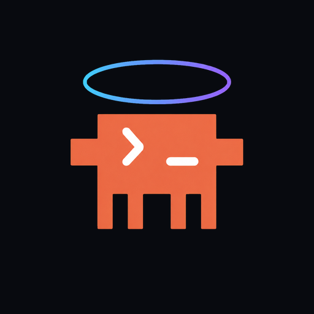
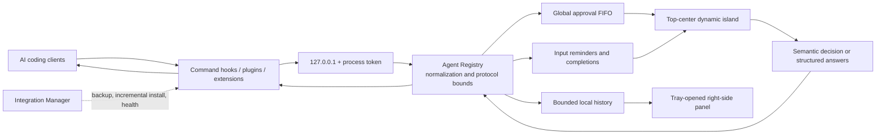

# Vibe Halo

<div align="center">



**English** · [简体中文](README.zh-CN.md)

**A cross-platform approval popup and Dynamic Island for Codex, ZCode, Claude Code, OpenCode, and other AI coding agents.**

Handle supported permission requests and interactive questions, and receive completion notifications without constantly switching back to agent terminals.


[](LICENSE)

[Download releases](https://github.com/DaliBerr/Vibe-Halo/releases) ·
[Report an issue](https://github.com/DaliBerr/Vibe-Halo/issues) ·
[Release guide](docs/RELEASING.md)

<br><br>


</div>

> [!NOTE]
> **Runtime validation:** Codex and ZCode on Windows have completed real client round-trip testing in the maintainer's environment. macOS and Linux currently have CI, protocol, packaging, and startup smoke coverage only. All other client/platform combinations may still contain compatibility bugs; keep their native approval UI available while evaluating them.

> [!IMPORTANT]
> Vibe Halo is a derivative development of [Clawd on Desk](https://github.com/rullerzhou-afk/clawd-on-desk), maintained independently and not an official upstream edition. It retains and adapts parts of the upstream hook, plugin, approval transport, process-discovery, and lifecycle design, while removing the desktop pet, themes, animated session state, remote approval, and mobile features. See [NOTICE.md](NOTICE.md) for upstream copyright and attribution.

Vibe Halo appears at the top of the active display when you need to intervene. Supported approval requests can be allowed or denied in place, questions with a stable answer protocol can be completed inside the island, and finished tasks produce short notifications. If no explicit decision is made—or if the app, transport, or protocol fails—the request is returned to the native client flow instead of being automatically allowed or denied.

## Quick start

1. Download the Windows x64 stable installer from the latest [GitHub Release](https://github.com/DaliBerr/Vibe-Halo/releases), or choose the newest **Cross-platform Preview** for macOS 12+ arm64/x64 DMG/ZIP and Linux x64 AppImage/deb packages.
2. Launch Vibe Halo and open **Client integrations** from the tray to inspect detected clients and integration health.
3. If you use Codex, enter `/hooks` in Codex and review the installed Vibe Halo command hooks before triggering an approval.

> [!WARNING]
> Packages labeled **Preview** are testing-only. Windows SmartScreen may show an unknown-publisher warning. macOS packages are ad-hoc signed, not Developer ID signed or notarized; use Finder's context menu and choose **Open** when prompted. Automatic updates are disabled in all preview packages.

See [Installation and setup](#installation-and-setup) for source builds, integration details, and the complete verification flow.

## Table of contents

- [Quick start](#quick-start)
- [Why Vibe Halo](#why-vibe-halo)
- [Key features](#key-features)
- [Client support](#client-support)
- [How it works](#how-it-works)
- [Installation and setup](#installation-and-setup)
- [Daily use](#daily-use)
- [Security and privacy](#security-and-privacy)
- [Architecture](#architecture)
- [Development](#development)
- [Testing](#testing)
- [Building and releasing](#building-and-releasing)
- [Environment variables](#environment-variables)
- [FAQ](#faq)
- [Troubleshooting](#troubleshooting)
- [Known boundaries](#known-boundaries)
- [Contributing](#contributing)
- [Upstream, acknowledgments, and license](#upstream-acknowledgments-and-license)

## Why Vibe Halo

AI coding clients often wait in the background for a permission decision, a follow-up answer, or a finished task that is easy to miss. Vibe Halo brings those intervention points into lightweight desktop surfaces while preserving each client's native flow as the final fallback.

- **Appears only when needed** — the window is fully hidden when there is no active item and never occupies the taskbar.
- **Top-center placement** — the compact island sits at the top of the active display and accounts for multiple monitors and DPI scaling.
- **One queue** — all clients share a global FIFO, so approvals cannot cover or reorder one another.
- **Clear provenance** — the title always identifies the client that produced the event.
- **Fail-open to the native UI** — close, disconnect, timeout, malformed response, and unknown option paths never invent a decision.
- **Local by design** — agent events use a token-authenticated loopback service; there is no remote approval endpoint.
- **Optional local history** — a tray-opened, freely draggable side panel keeps bounded approval, question, and Codex/ZCode plan details without occupying the desktop permanently.

## Key features

### Dynamic-island interaction

- The compact view shows the client, a short event summary, and pending count; click it to expand.
- Every registered client has a stable color and one- or two-character badge. The compact client chip and expanded badge match, while the separate status dot keeps its approval/input/completion meaning.
- The tray uses a small-size optimized, tightly framed representation so the Halo mark remains legible at common system-tray scaling levels.
- The expanded view presents commands, patches, queries, descriptions, working directories, and bounded structured parameters.
- Use the small island control at the top center—or press `Esc`—to collapse without dismissing the item or deciding an approval.
- The action bar stays fixed at the bottom. When more than three options exist, lower-frequency actions move into a “More” menu.
- Interactive forms support single choice, multiple choice, and free text, with at most 10 questions and 20 options per question.
- Native light/dark appearance, animated bounds, multi-display placement, and high-DPI constraints are built in.

### Approvals and notifications

- Allow once, deny, hand back to the client, and similar actions are mapped only when the source protocol actually provides them.
- OpenCode displays `Always` only when the original request explicitly advertises that capability.
- Duplicate requests from the same client are coalesced, and the final result is fanned out to every waiting connection.
- When a Codex or ZCode turn stops in Plan mode, Vibe Halo shows a dedicated plan-ready notification with the completed plan output when available.
- Completion notifications normally remain visible for 8 seconds; a new prompt or approval preempts an older completion.
- UI priority is fixed: **approval/exact interaction > input reminder > completion notification**.

### Recent events

- Open **Recent events** from the tray to show a separate 460 × 720 right-side panel; drag either view's top header to reposition it. The live top-center island remains independent and stays above it.
- The list can be filtered by all events, approvals, questions, plans, or source client. Selecting an entry opens read-only details with separate copy controls for commands, parameters, answers, content, and working directories.
- Approval outcomes—including allow, deny, return-to-client, timeout, disconnect, and close—are retained. Exact in-island answers and best-effort Codex `request_user_input` answers are retained; incompatible Codex output is marked as unavailable.
- Codex and ZCode plan-ready output is retained. Ordinary task-completion notifications are deliberately excluded.
- History keeps at most 200 events for 30 days and caps its file at 16 MiB. Moving the pointer away closes the panel after five seconds; the tray is its only entry point.

### Integration management

- At startup, Vibe Halo detects clients by executable or initialized configuration and incrementally installs or repairs detected integrations.
- Each client receives its own first-state backup before any edit. JSON, JSONC, TOML, and plugin installers preserve third-party content.
- Explicit client disables—such as Codex `hooks=false`—are respected and are never silently reversed.
- The tray can disable or re-enable each client, rescan, repair all integrations, or uninstall all Vibe Halo-managed entries.
- A user-disabled client is recorded as an override and is not automatically reinstalled on the next launch.

### Updates

- Automatic updates are enabled only in official Windows stable builds. The default stable channel is unsigned and uses GitHub Releases plus SHA-512 integrity metadata; macOS and Linux updates remain disabled.
- Official Windows stable builds check and download stable releases from GitHub Releases in the background.
- Installation always requires an explicit “Restart and update” action from the tray; a normal quit does not install an update.
- Before updating, the local server is stopped and pending approvals/questions are returned to their native client flows.
- Source, local, and preview builds deliberately keep automatic updates disabled.

## Client support

Vibe Halo currently registers 19 clients. “Supported” means that the repository contains an adapter and automated contract coverage; it does **not** mean that every client has passed a real runtime acceptance test.

> [!WARNING]
> Only **Codex** and **ZCode** have completed real client triggering, dynamic-island interaction, and response round-trip verification in the maintainer's environment. The other 17 integrations are based primarily on public protocols, the previous repository implementation, and automated contract tests. They may contain bugs caused by client-version differences, configuration changes, or subtle response-protocol mismatches. Keep the client's native approval UI available and inspect the tray diagnostics when evaluating these integrations.

| Capability tier | Clients | Vibe Halo behavior |
| --- | --- | --- |
| Dynamic-island approval | Codex, ZCode, Qwen Code, Copilot CLI, Claude Code, CodeBuddy, Hermes, OpenCode | Shows only options declared by the client adapter and encodes the selected result into the native protocol |
| Exact in-island answers | ZCode `AskUserQuestion`, Claude/CodeBuddy Elicitation, Hermes clarify | Renders a structured form and maps validated answers back to the original protocol |
| Native approval reminder | Kimi Code, Qoder, QoderWork | Tells you to approve in the client and does not answer on the client's behalf |
| Completion/status notification | Gemini CLI, Antigravity, Cursor Agent, Kiro, CodeWhale, Pi, OpenClaw, Reasonix, plus the clients above | Shows completion after `Stop` or an equivalent event; a new prompt clears the old notification for that session |

> [!NOTE]
> Codex `request_user_input` is currently reminder-only. Vibe Halo reads Codex session JSONL to detect when the request is resolved, but it never writes answers to the session file or bypasses the native Codex answer UI.

## How it works



1. A client hook or managed plugin converts its event into a bounded request.
2. The hook reads the current loopback port and process token from `~/.vibe-halo/runtime.json`.
3. The main process selects an adapter by `agentId` and normalizes an approval, elicitation, or attention event.
4. The current item enters the global queue. The renderer receives only display data and stable option IDs.
5. After the user acts, the main process validates the current request ID, option, and answers again before the adapter encodes a native response.
6. If any stage cannot complete safely, the adapter returns its no-decision output and the client resumes its native flow.

## Installation and setup

### Use a release build

Download Windows stable builds or the newest three-platform Preview from [GitHub Releases](https://github.com/DaliBerr/Vibe-Halo/releases):

| Platform | Supported baseline | Channel and artifacts |
| --- | --- | --- |
| Windows | Windows 10/11 x64 | Latest stable or Preview: `Vibe-Halo-Setup-<version>-x64.exe` |
| macOS | macOS 12+, Apple Silicon or Intel | Cross-platform Preview: `Vibe-Halo-<version>-arm64.dmg` / `.zip`, `Vibe-Halo-<version>-x64.dmg` / `.zip` |
| Linux | Ubuntu 22.04/24.04 or Debian 12 x64 | Cross-platform Preview: `Vibe-Halo-<version>-x64.AppImage`, `Vibe-Halo-<version>-x64.deb` |

Other Linux distributions may work with the AppImage, but are not part of the first release guarantee. Preview packages are not publisher-signed; verify the published SHA-256 list and download only from this repository.

After installation:

1. Launch Vibe Halo. It stays in the system tray and shows no main window until an event arrives.
2. The app scans installed or initialized supported clients and incrementally adds its own hook/plugin entries.
3. Open the tray's **Client integrations** submenu to inspect detection and health.
4. For Codex, enter `/hooks` in Codex and review the Vibe Halo `PermissionRequest`, `Stop`, and `UserPromptSubmit` entries under the user-level `~/.codex/hooks.json`.
5. Trigger one approval or completion from the client and confirm that the island appears and that the result returns correctly.

> [!WARNING]
> Codex 0.129.0 and later require the user to trust new or changed command hooks. Vibe Halo can write and repair the configuration, but it does not bypass the official trust review.

The Windows installer and the application contain English and Simplified Chinese resources. Vibe Halo follows the operating-system UI locale by default; use **Language** in the tray to switch immediately without restarting the app.

#### macOS first launch

The preview has only an ad-hoc signature required for reliable Apple Silicon launch. It is not signed with an Apple Developer ID and is not notarized. Drag the app from the DMG to **Applications**, then Control-click or right-click Vibe Halo in Finder, choose **Open**, and confirm once. Vibe Halo runs as an accessory app without a Dock icon and does not request Accessibility or Screen Recording permission.

#### Linux window backend

Vibe Halo prefers X11. In a Wayland session it uses XWayland when `DISPLAY` is available so the island can still be positioned and animated. If XWayland is unavailable, it starts in native-Wayland degraded mode and diagnostics report that precise window positioning, resizing, or focus may be limited. Set `VIBE_HALO_NATIVE_WAYLAND=1` only when you intentionally want to force that degraded native mode.

### Run from source

Running from source is intended for contributing, integration debugging, and unreleased validation. It performs the same client detection and may incrementally edit real client configurations, so read the integration behavior above first.

#### Prerequisites

- Windows x64, macOS 12+ arm64/x64, or Linux x64. Windows remains the primary real-client acceptance environment.
- [Node.js 24](https://nodejs.org/) and npm, matching release CI.
- Git.
- At least one supported client for real integration testing; automated tests do not require one.

```powershell
git clone https://github.com/DaliBerr/Vibe-Halo.git
Set-Location Vibe-Halo

# Install exactly from the lockfile
npm ci

# Run automated tests before launching
npm test

# Start the Electron application
npm start
```

Use `npm install` and commit the updated `package-lock.json` when intentionally changing dependencies. Prefer `npm ci` for reproducible installs at all other times.

## Daily use

### Dynamic island

- **Expand** — click the compact island.
- **Collapse** — click the small island control at the top center of the expanded view, or press `Esc`.
- **Close an approval** — clicking `×` does not mean deny; Vibe Halo returns no decision so the native client flow can continue.
- **Allow or deny** — only an action belonging to the current request can produce a response.
- **Copy content** — copy the primary displayed content from the expanded view; IPC enforces a length bound.
- **Inspect full parameters** — open the details section to view the sanitized structured input.

### Tray menu

The tray exposes the following controls in English mode:

| Menu item | Purpose |
| --- | --- |
| **Enable approvals** | Global island-approval switch; when disabled, approvals return to the client while completion notifications continue |
| **Input reminders** | Controls read-only input reminders and native-approval reminders |
| **Recent events** | Opens the independent right-side history panel and shows the current retained count |
| **Record recent events** | Stops or resumes future history capture without deleting existing records |
| **Launch at login** | Controls operating-system login startup |
| **Client integrations** | Shows status and provides per-client disable/enable, rescan, repair, and uninstall-all actions |
| **Review Codex Hook…** | Explains how to complete the official Codex `/hooks` trust review |
| **Repair Codex Hook** | Incrementally repairs Vibe Halo-managed Codex configuration |
| **Diagnostics** | Shows service, queue, integration verification, update status, active locale, and log location |
| **Language** | Chooses Follow system, English, or Simplified Chinese; the island and queued items update immediately |
| **Check for updates** | Appears only in official Windows stable builds |

### Remove integrations

Use **Client integrations → Uninstall all…** to remove every Vibe Halo-managed integration, or run this from a source checkout:

```shell
npm start -- --uninstall-hooks
```

The Windows NSIS uninstaller invokes the same cleanup path. On macOS, dragging the app to Trash cannot run integration cleanup, so run **Uninstall all…** before removing the app. On Linux, do the same before removing the AppImage or package. Stale launchers always fail open, but explicit cleanup avoids leaving dead Hook entries. Cleanup removes only Vibe Halo-owned hook/plugin records; third-party configuration, first-state backups, and application user data are retained.

## Security and privacy

- The service listens only on `127.0.0.1`, never on a LAN or public interface.
- A new token is generated for each process. Requests require that token and are limited to 256 KiB.
- The OpenCode reverse bridge uses a separate random bearer token, bounded request IDs, replay protection, and loopback target validation.
- The renderer uses context isolation and sandboxing, with Node access, navigation, and new windows disabled.
- The renderer cannot access raw client protocol payloads, configuration rules, bridge tokens, or the updater.
- IPC validates the current request ID, option ID, types, answer counts, and answer lengths.
- Logs omit process tokens and full command content and rotate by size.
- The app has no telemetry, account system, cloud synchronization, or remote approval service.
- An official Windows stable build contacts public GitHub Releases only for update checks. Source, local, and preview builds keep the updater disabled.
- Client configuration uses atomic writes, first-state backups, and ownership markers. Explicit hook disables are preserved.
- Recent-event records contain locally visible commands, parameters, paths, questions, and answers. Obvious structured secret fields are replaced with `[REDACTED]`, but command strings can still contain secrets typed by the user.
- The history file uses Electron `safeStorage` encryption when a secure backend is available. If encryption is unavailable—or Linux reports `basic_text`—Vibe Halo stores history as plaintext, displays a persistent warning in the panel, and shows a one-time warning before first opening it.
- History is never synchronized or sent to a remote service. Corrupt or undecryptable history does not block startup or approvals and is left untouched while the current run falls back to empty in-memory history.

The runtime identity is stored by default at:

```text
%USERPROFILE%\.vibe-halo\runtime.json
```

Settings, logs, and integration backups live under Electron's `userData` directory. A typical installed path is:

```text
%APPDATA%\Vibe Halo\
├── settings.json
├── history.json
├── logs\main.log
└── integration-backups\
```

## Architecture

### Technology stack

| Layer | Technology |
| --- | --- |
| Desktop runtime | Electron 41, CommonJS, Node.js |
| UI | Native HTML, CSS, and JavaScript in one live-island window plus one optional history window |
| Local transport | Node HTTP, loopback-only, per-process token |
| Platform integration | `PlatformAdapter`, `koffi` on Windows, POSIX launchers, system tray |
| Packaging | x64 NSIS; arm64/x64 DMG and ZIP; x64 AppImage and deb |
| Automatic updates | Official Windows stable channel (unsigned by default, optional SignPath); disabled for macOS/Linux |
| Tests | Node's built-in test runner |
| Release | GitHub Actions, electron-builder, SignPath Foundation |

The project has no database, web backend, frontend framework, Docker deployment, or `.env` file.

### Directory structure

```text
.
├── src/
│   ├── main.js                  # Electron lifecycle, tray, and service wiring
│   ├── platform-adapter.js      # OS paths, stable hooks, login items, notifications, window backend
│   ├── agent-registry.js        # 19 adapters, normalization, options, response codecs
│   ├── integration-manager.js   # Detection, backup, install, health, repair, removal
│   ├── server.js                # Token-authenticated 127.0.0.1 HTTP gateway
│   ├── approval-store.js        # Global approval FIFO, deduplication, connection lifecycle
│   ├── input-request-store.js   # Input and native-approval reminder queue
│   ├── completion-store.js      # Completion-notification lifecycle
│   ├── codex-input-monitor.js   # Read-only Codex session JSONL monitor
│   ├── island-controller.js     # Live island placement, priority, IPC, animation
│   ├── history-store.js         # Bounded encrypted/plaintext recent-event persistence
│   ├── history-events.js        # Approval, question, native-answer, and plan mapping
│   ├── history-window-controller.js # Isolated right-side history window and IPC
│   ├── history-preload.js       # Constrained history renderer bridge
│   ├── update-manager.js        # Signed-build gate, checks, downloads, explicit install
│   ├── shutdown-coordinator.js  # Ordered safe shutdown shared by quit and update
│   ├── renderer/                # Native dynamic-island UI
│   └── history-renderer/        # Native read-only history UI
├── hooks/
│   ├── vibe-halo-hook.js        # Self-contained generic command hook
│   └── integrations/            # Managed Hermes, OpenCode, OpenClaw, and Pi assets
├── test/                         # Protocol, store, installer, IPC, window, release tests
├── scripts/                      # Signing staging, update metadata, release config tools
├── docs/
│   ├── assets/vibe-halo-demo.gif # README demonstration
│   └── RELEASING.md              # SignPath and signed-release guide
├── electron-builder.config.cjs   # Windows, macOS, and Linux packaging configuration
├── README.zh-CN.md               # Simplified Chinese documentation
├── LICENSE                       # AGPL-3.0-only
└── NOTICE.md                     # Upstream attribution and derivative notice
```

## Development

### Available commands

| Command | Description |
| --- | --- |
| `npm ci` | Install the exact dependency graph from the lockfile |
| `npm install` | Install dependencies and permit lockfile updates; use only for dependency changes |
| `npm test` | Run the full Node test suite |
| `npm start` | Start Electron from source and scan local client integrations |
| `npm run build:dir` | Produce unpacked output for the current host platform |
| `npm run build` | Produce unsigned packages for the current host platform |
| `npm run build:win` | Produce the Windows x64 NSIS package |
| `npm run build:mac:arm64` / `npm run build:mac:x64` | Produce macOS DMG and ZIP packages on macOS |
| `npm run build:linux:x64` | Produce Linux x64 AppImage and deb packages on Linux |
| `npm run build:prepackaged` | Build NSIS from a prepackaged directory; mainly used by the signing workflow |
| `npm run release:metadata` | Regenerate blockmap, hashes, and `latest.yml` for the final signed installer |

### Isolated smoke run

An ordinary `npm start` scans real client configuration. For a startup smoke test that does not touch real client paths, use a fresh PowerShell session and temporarily redirect the relevant roots:

```powershell
$testRoot = Join-Path $PWD ".smoke"
$env:USERPROFILE = Join-Path $testRoot "home"
$env:APPDATA = Join-Path $testRoot "appdata"
$env:LOCALAPPDATA = Join-Path $testRoot "localappdata"
$env:CODEX_HOME = Join-Path $testRoot "codex"
$env:VIBE_HALO_USER_DATA = Join-Path $testRoot "userdata"
$env:VIBE_HALO_RUNTIME_DIR = Join-Path $testRoot "runtime"
$env:VIBE_HALO_TEST = "1"

npm start -- --smoke-test
```

`.smoke/` is ignored by Git. Close that PowerShell session to discard the temporary environment overrides.

### Development principles

- Preserve CommonJS and the native renderers. Keep the window boundary to one live island plus one optional tray-opened history window.
- Protocol, queue, timeout, IPC, window-size, and integration-installer changes require regression tests.
- Never commit `node_modules/`, `dist/`, `.smoke/`, logs, credentials, or local runtime data.
- After changing hook command paths, run “Repair all” and review the changed commands again in Codex `/hooks`.
- Close, error, and protocol uncertainty must continue to use the no-decision fallback.

## Testing

```powershell
npm test
```

The automated suite covers:

- Registration, capability declarations, event normalization, and bounded output for all 19 adapters.
- Allow, deny, no-decision, and structured-answer snapshots for each approval protocol.
- Cross-client FIFO, deduplication isolation, repeated connections, timeouts, disconnects, and shutdown fallback.
- Loopback authentication, request-size bounds, invalid option IDs, bridge tokens, and replay protection.
- JSON, JSONC, TOML, and plugin backup, idempotence, third-party preservation, and safe uninstall behavior.
- Settings migration, automatic detection, user-disable overrides, diagnostics, and update state.
- Renderer IPC, dynamic actions, question forms, window bounds, shadow gutters, multi-display placement, and X11 source-window matching.
- History retention/capacity, encryption/plaintext fallback, corruption recovery, redaction, semantic event capture, isolated IPC, filters, details, localization, right-side placement, fade timing, and dual-window smoke screenshots.
- Windows and POSIX command-hook mock-server end-to-end behavior, stable launcher paths, and offline fallback.
- Unsigned/signed release gates, public update configuration, SignPath staging, and final-byte metadata generation.

Windows transparent-window behavior, shadows, focus, animation, multi-display/DPI, real-client round trips, tray behavior, NSIS removal, and live N-to-N+1 updates still require manual acceptance. macOS/Linux currently have CI protocol, package, launcher, and startup smoke tests only; real client response round trips on those platforms remain unverified.

## Building and releasing

### Local build

```shell
npm run build:dir
npm run build
```

Host-specific output:

```text
Windows: Vibe-Halo-Setup-<version>-x64.exe
macOS:   Vibe-Halo-<version>-arm64|x64.dmg and .zip
Linux:   Vibe-Halo-<version>-x64.AppImage and .deb
```

Local artifacts are expected to be unsigned and contain `autoUpdateEnabled=false`. Do not publish a local artifact as an official update.

### Unsigned three-platform preview

The `preview-<version>` tag triggers the cross-platform workflow. It tests on Windows 2025, macOS 15 arm64 and Intel, and Ubuntu 24.04; builds on Windows 2025, both macOS architectures, and Ubuntu 22.04; then publishes all packages plus `SHA256SUMS.txt` as a GitHub Pre-release. It deliberately does not publish stable update metadata.

### Windows stable release

A `v<version>` tag triggers the GitHub Actions release workflow, which:

1. Verifies that the tag matches the package version and points to a commit on `main`.
2. Installs dependencies and runs the complete test suite.
3. Builds an update-enabled Windows x64 NSIS installer. The default route is unsigned; setting the protected `VIBE_HALO_SIGNPATH_ENABLED=1` repository variable activates the retained SignPath pipeline.
4. Regenerates the blockmap, SHA-256 list, and `latest.yml` from the final installer bytes.
5. Silently installs, verifies installed files and updater configuration, uninstalls, and only then publishes a stable Latest GitHub Release.

See [docs/RELEASING.md](docs/RELEASING.md) for the default unsigned release procedure and the optional SignPath configuration.

## Environment variables

Normal installations require no manual environment configuration. These variables support custom client roots, testing, or the protected release workflow:

| Variable | Purpose |
| --- | --- |
| `CODEX_HOME` | Override the Codex configuration and session root |
| `COPILOT_HOME` | Override the Copilot CLI configuration root |
| `OPENCLAW_STATE_DIR` | Override the OpenClaw state directory |
| `VIBE_HALO_RUNTIME_DIR` | Override the loopback runtime-identity directory |
| `VIBE_HALO_USER_DATA` | Override Electron `userData`; used for test isolation |
| `VIBE_HALO_TEST=1` | Enable test/smoke behavior and suppress real login startup and updates |
| `VIBE_HALO_NATIVE_WAYLAND=1` | Force native Wayland instead of XWayland; window positioning/animation may be degraded |
| `VIBE_HALO_SCREENSHOT` | Save a window capture during the demo test path |
| `VIBE_HALO_AUTO_UPDATE=1` | Embed the official Windows stable-channel updater gate; protected release builds only |
| `VIBE_HALO_PUBLISHER_NAME` | Set the exact Authenticode publisher Subject for the optional SignPath route |
| `VIBE_HALO_EXTERNAL_SIGNING=1` | Enable the electron-builder external SignPath staging script |
| `VIBE_HALO_SIGN_STAGE_DIR` | Staging directory for external signing artifacts |
| `VIBE_HALO_SIGNED_ELEVATE` | Path to the signed NSIS elevation helper |
| `VIBE_HALO_SIGNED_UNINSTALLER` | Path to the signed generated uninstaller |
| `VIBE_HALO_RELEASE_DATE` | Supply a reproducible release date for update metadata |

The repository variable `VIBE_HALO_SIGNPATH_ENABLED=1` activates optional SignPath signing; absent or `0` keeps the stable release unsigned. Signing variables belong only in protected CI. The SignPath API token is a GitHub Actions secret—not an application environment variable—and must never appear in source, logs, or release assets.

## FAQ

### Is Vibe Halo a cross-platform alternative to Vibe Island?

Vibe Halo provides a similar top-center approval and notification workflow on Windows, macOS, and common x64 Linux systems, but it is an independent open-source project rather than an official Vibe Island edition. It appears only when an AI coding agent needs a supported permission decision, asks a supported interactive question, or completes a task.

### Can I approve Codex permissions without returning to the terminal?

Yes. Supported Codex `PermissionRequest` events can be allowed or denied directly from the approval popup. If Vibe Halo cannot safely return a decision—or if you close or time out the request—it returns no decision so Codex can resume its native approval flow. Codex `request_user_input` remains reminder-only and must still be answered in Codex.

### Does Vibe Halo support Claude Code and OpenCode?

Vibe Halo includes adapters, installers, and automated contract tests for Claude Code and OpenCode. However, only Codex and ZCode have completed full real-client round-trip verification in the maintainer's environment. Treat the Claude Code, OpenCode, and other non-validated integrations as preview support and keep their native approval interfaces available.

## Troubleshooting

### The island does not appear

1. Confirm that the tray reports a running service or healthy client integrations.
2. Confirm that **Enable approvals** or **Input reminders** is enabled.
3. Open **Client integrations** and run **Rescan** or **Repair all**.
4. Open diagnostics and check whether the client is healthy, needs repair, or was not detected.
5. Use the diagnostics dialog to open the log directory and inspect `main.log`.

### Codex reports pending hook review

1. Enter `/hooks` in Codex.
2. Locate the user-level `~/.codex/hooks.json` entry.
3. Review and trust the Vibe Halo `PermissionRequest`, `Stop`, and `UserPromptSubmit` commands.
4. Run **Repair Codex Hook** from the tray and inspect diagnostics again.

### A client is detected but cannot be installed

- If diagnostics say that the client disabled hooks, enable them explicitly in the client first. Vibe Halo does not override that setting.
- If only the executable exists and the configuration directory is not initialized, launch the client once before rescanning.
- A user-disabled integration is not automatically restored; re-enable it in the client-integration submenu.
- Client updates can change unstable hook protocols. Include the client version and sanitized diagnostics in an issue.

### The client still waits after the island is closed

This is expected. Closing an approval does not choose deny. Vibe Halo returns no decision and expects the client to resume its native approval flow. If the native UI does not resume, report the client version and event type.

### There is no update item in the tray

Source runs, local packages, and preview builds deliberately disable automatic updates. Update controls exist only in official Windows stable builds created with `VIBE_HALO_AUTO_UPDATE=1`; macOS/Linux packages never enable them.

## Known boundaries

- Release targets are Windows x64, macOS 12+ arm64/x64, and Ubuntu 22.04/24.04 or Debian 12 x64. Other Linux distributions are best-effort through AppImage; Linux arm64, RPM, Snap, Flatpak, and Mac App Store packages are not provided.
- Native Wayland does not provide the same programmable placement, resize, and focus guarantees. XWayland is preferred; the native backend is explicitly diagnosed as degraded.
- The application UI and Windows installer support English and Simplified Chinese; unsupported system locales fall back to English unless Simplified Chinese is selected manually.
- Vibe Halo does not include the upstream desktop pet, animated themes, session dashboard, terminal focus, remote SSH, PWA, or mobile features.
- Remote approval is not supported, and the service never listens on a LAN interface.
- Not every client exposes a stable approval or answer protocol. Unsupported capabilities remain reminders or are handed back to the native client.
- Codex `request_user_input` cannot be answered inside the island.
- Status-only clients produce completion/attention events, not continuous working animations.
- Recent events are local and can contain sensitive content. Structured secret-looking keys are redacted, but users should still review commands before enabling history on shared machines; ordinary completion notifications are never recorded.
- Only Codex and ZCode on Windows have completed real client end-to-end verification. macOS/Linux and other integrations can still contain compatibility bugs even when CI and contract tests pass.

## Contributing

Bug reports, protocol compatibility findings, and improvements focused on the dynamic-island experience are welcome.

1. Open an [issue](https://github.com/DaliBerr/Vibe-Halo/issues) describing the goal, client version, and reproducible steps.
2. Create a single-purpose branch from the latest `main`.
3. Preserve incremental third-party configuration handling and native/no-decision fallback semantics.
4. Add tests for behavioral changes and run `npm test`.
5. For window, hook, or packaging work, document the relevant host-platform manual or CI acceptance results.

Do not submit real client configurations, runtime tokens, full command logs, or other personal data.

## Upstream, acknowledgments, and license

Vibe Halo is derived from [rullerzhou-afk/clawd-on-desk](https://github.com/rullerzhou-afk/clawd-on-desk). We thank the upstream maintainers and contributors for the multi-client hook, plugin, approval transport, and lifecycle foundation.

Compared with upstream, this repository is a deliberate secondary development with a different product direction:

- It narrows a cross-platform desktop pet into a focused three-platform top-center dynamic island.
- It removes pet artwork, themes, the animated state machine, remote features, and mobile features.
- It keeps and restructures the protocol pieces needed for local approvals, structured answers, and completion notifications.
- It strengthens the global FIFO, renderer isolation, configuration ownership, native fallback, and signed update pipeline.

Vibe Halo is independently maintained and is not affiliated with or endorsed by the Clawd on Desk maintainers, OpenAI, Anthropic, or any supported client vendor.

Source code is distributed under the [GNU Affero General Public License v3.0 only](LICENSE) (`AGPL-3.0-only`). When redistributing or deploying a modified version, comply with the AGPL-3.0 source-availability obligations and retain the upstream copyright and attribution in [NOTICE.md](NOTICE.md).
