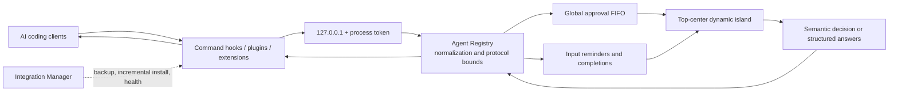

# Vibe Halo

<div align="center">

**English** · [简体中文](README.zh-CN.md)

**A Windows dynamic island for approvals, interactive questions, and completion notifications from AI coding clients.**


[](LICENSE)

[Download releases](https://github.com/DaliBerr/Vibe-Halo/releases) ·
[Report an issue](https://github.com/DaliBerr/Vibe-Halo/issues) ·
[Release guide](docs/RELEASING.md)

<br><br>


</div>

> [!IMPORTANT]
> Vibe Halo is a derivative development of [Clawd on Desk](https://github.com/rullerzhou-afk/clawd-on-desk), maintained independently and not an official upstream edition. It retains and adapts parts of the upstream hook, plugin, approval transport, and lifecycle design, while removing the desktop pet, themes, animated session state, remote approval, and mobile features. See [NOTICE.md](NOTICE.md) for upstream copyright and attribution.

Vibe Halo appears at the top of the active display when you need to intervene. Supported approval requests can be allowed or denied in place, questions with a stable answer protocol can be completed inside the island, and finished tasks produce short notifications. If no explicit decision is made—or if the app, transport, or protocol fails—the request is returned to the native client flow instead of being automatically allowed or denied.

## Table of contents

- [Why Vibe Halo](#why-vibe-halo)
- [Key features](#key-features)
- [Client support](#client-support)
- [How it works](#how-it-works)
- [Quick start](#quick-start)
- [Daily use](#daily-use)
- [Security and privacy](#security-and-privacy)
- [Architecture](#architecture)
- [Development](#development)
- [Testing](#testing)
- [Building and releasing](#building-and-releasing)
- [Environment variables](#environment-variables)
- [Troubleshooting](#troubleshooting)
- [Known boundaries](#known-boundaries)
- [Contributing](#contributing)
- [Upstream, acknowledgments, and license](#upstream-acknowledgments-and-license)

## Why Vibe Halo

AI coding clients often wait in the background for a permission decision, a follow-up answer, or a finished task that is easy to miss. Vibe Halo brings those intervention points into one lightweight window while preserving each client's native flow as the final fallback.

- **Appears only when needed** — the window is fully hidden when there is no active item and never occupies the taskbar.
- **Top-center placement** — the compact island sits at the top of the active display and accounts for multiple monitors and DPI scaling.
- **One queue** — all clients share a global FIFO, so approvals cannot cover or reorder one another.
- **Clear provenance** — the title always identifies the client that produced the event.
- **Fail-open to the native UI** — close, disconnect, timeout, malformed response, and unknown option paths never invent a decision.
- **Local by design** — agent events use a token-authenticated loopback service; there is no remote approval endpoint.

## Key features

### Dynamic-island interaction

- The compact view shows the client, a short event summary, and pending count; click it to expand.
- The expanded view presents commands, patches, queries, descriptions, working directories, and bounded structured parameters.
- Use the small island control at the top center—or press `Esc`—to collapse without dismissing the item or deciding an approval.
- The action bar stays fixed at the bottom. When more than three options exist, lower-frequency actions move into a “More” menu.
- Interactive forms support single choice, multiple choice, and free text, with at most 10 questions and 20 options per question.
- Native light/dark appearance, animated bounds, multi-display placement, and high-DPI constraints are built in.

### Approvals and notifications

- Allow once, deny, hand back to the client, and similar actions are mapped only when the source protocol actually provides them.
- OpenCode displays `Always` only when the original request explicitly advertises that capability.
- Duplicate requests from the same client are coalesced, and the final result is fanned out to every waiting connection.
- Completion notifications normally remain visible for 8 seconds; a new prompt or approval preempts an older completion.
- UI priority is fixed: **approval/exact interaction > input reminder > completion notification**.

### Integration management

- At startup, Vibe Halo detects clients by executable or initialized configuration and incrementally installs or repairs detected integrations.
- Each client receives its own first-state backup before any edit. JSON, JSONC, TOML, and plugin installers preserve third-party content.
- Explicit client disables—such as Codex `hooks=false`—are respected and are never silently reversed.
- The tray can disable or re-enable each client, rescan, repair all integrations, or uninstall all Vibe Halo-managed entries.
- A user-disabled client is recorded as an override and is not automatically reinstalled on the next launch.

### Updates

- Automatic updates are enabled only in official Windows builds whose publisher signature matches the trusted configuration.
- Signed builds check and download stable releases from GitHub Releases in the background.
- Installation always requires an explicit “Restart and update” action from the tray; a normal quit does not install an update.
- Before updating, the local server is stopped and pending approvals/questions are returned to their native client flows.
- Local and unsigned builds deliberately keep automatic updates disabled.

## Client support

Vibe Halo currently registers 19 clients. “Supported” means that the repository contains an adapter and automated contract coverage; it does **not** mean that every client has passed a real runtime acceptance test.

> [!WARNING]
> Only **Codex** and **ZCode** have completed real client triggering, dynamic-island interaction, and response round-trip verification in the maintainer's environment. The other 17 integrations are based primarily on public protocols, the previous repository implementation, and automated contract tests. They may contain bugs caused by client-version differences, configuration changes, or subtle response-protocol mismatches. Keep the client's native approval UI available and inspect the tray diagnostics when evaluating these integrations.

| Capability tier | Clients | Vibe Halo behavior |
| --- | --- | --- |
| Dynamic-island approval | Codex, ZCode, Qwen Code, Copilot CLI, Claude Code, CodeBuddy, Hermes, OpenCode | Shows only options declared by the client adapter and encodes the selected result into the native protocol |
| Exact in-island answers | ZCode `AskUserQuestion`, Claude/CodeBuddy Elicitation, Hermes clarify | Renders a structured form and maps validated answers back to the original protocol |
| Native approval reminder | Kimi Code, Qoder, QoderWork | Tells you to approve in the client and does not answer on the client's behalf |
| Completion/status notification | Gemini CLI, Antigravity, Cursor Agent, Kiro, CodeWhale, Pi, OpenClaw, Reasonix, plus the clients above | Shows completion after `Stop` or an equivalent event; a new prompt clears the old notification for that session |

> [!NOTE]
> Codex `request_user_input` is currently reminder-only. Vibe Halo reads Codex session JSONL to detect when the request is resolved, but it never writes answers to the session file or bypasses the native Codex answer UI.

## How it works



1. A client hook or managed plugin converts its event into a bounded request.
2. The hook reads the current loopback port and process token from `~/.vibe-halo/runtime.json`.
3. The main process selects an adapter by `agentId` and normalizes an approval, elicitation, or attention event.
4. The current item enters the global queue. The renderer receives only display data and stable option IDs.
5. After the user acts, the main process validates the current request ID, option, and answers again before the adapter encodes a native response.
6. If any stage cannot complete safely, the adapter returns its no-decision output and the client resumes its native flow.

## Quick start

### Use a release build

Download the current installer from [GitHub Releases](https://github.com/DaliBerr/Vibe-Halo/releases):

```text
Vibe-Halo-Setup-<version>-x64.exe
```

If the Releases page does not yet contain a signed installer, the public signing pipeline is not ready. Do not treat an unsigned installer from an unknown source as an official release.

After installation:

1. Launch Vibe Halo. It stays in the system tray and shows no main window until an event arrives.
2. The app scans installed or initialized supported clients and incrementally adds its own hook/plugin entries.
3. Open the tray's `客户端集成` (Client integrations) submenu to inspect detection and health.
4. For Codex, enter `/hooks` in Codex and review the Vibe Halo `PermissionRequest`, `Stop`, and `UserPromptSubmit` entries under the user-level `~/.codex/hooks.json`.
5. Trigger one approval or completion from the client and confirm that the island appears and that the result returns correctly.

> [!WARNING]
> Codex 0.129.0 and later require the user to trust new or changed command hooks. Vibe Halo can write and repair the configuration, but it does not bypass the official trust review.

### Run from source

Running from source is intended for contributing, integration debugging, and unreleased validation. It performs the same client detection and may incrementally edit real client configurations, so read the integration behavior above first.

#### Prerequisites

- Windows x64; the primary manual acceptance environment is Windows 11.
- [Node.js 24](https://nodejs.org/) and npm, matching release CI.
- Git.
- At least one supported client for real integration testing; automated tests do not require one.

```powershell
git clone https://github.com/DaliBerr/Vibe-Halo.git
Set-Location Vibe-Halo

# Install exactly from the lockfile
npm ci

# Run automated tests before launching
npm test

# Start the Electron application
npm start
```

Use `npm install` and commit the updated `package-lock.json` when intentionally changing dependencies. Prefer `npm ci` for reproducible installs at all other times.

## Daily use

### Dynamic island

- **Expand** — click the compact island.
- **Collapse** — click the small island control at the top center of the expanded view, or press `Esc`.
- **Close an approval** — clicking `×` does not mean deny; Vibe Halo returns no decision so the native client flow can continue.
- **Allow or deny** — only an action belonging to the current request can produce a response.
- **Copy content** — copy the primary displayed content from the expanded view; IPC enforces a length bound.
- **Inspect full parameters** — open the details section to view the sanitized structured input.

### Tray menu

The application UI is currently Simplified Chinese. These are the relevant tray items:

| Menu item | Purpose |
| --- | --- |
| `启用审批` (Enable approvals) | Global island-approval switch; when disabled, approvals return to the client while completion notifications continue |
| `等待输入提醒` (Input reminders) | Controls read-only input reminders and native-approval reminders |
| `开机启动` (Launch at login) | Controls Windows login startup |
| `客户端集成` (Client integrations) | Shows status and provides per-client disable/enable, rescan, repair, and uninstall-all actions |
| `审核 Codex Hook…` (Review Codex hook) | Explains how to complete the official Codex `/hooks` trust review |
| `修复 Codex Hook` (Repair Codex hook) | Incrementally repairs Vibe Halo-managed Codex configuration |
| `诊断信息` (Diagnostics) | Shows service, queue, integration verification, update status, and log location |
| `检查更新` (Check for updates) | Appears only in trusted, signed release builds |

### Remove integrations

Use `客户端集成 → 卸载全部…` (Client integrations → Uninstall all) to remove every Vibe Halo-managed integration, or run this from a source checkout:

```powershell
npm start -- --uninstall-hooks
```

The NSIS uninstaller invokes the same cleanup path. Cleanup removes only Vibe Halo-owned hook/plugin records; third-party configuration, first-state backups, and application user data are retained.

## Security and privacy

- The service listens only on `127.0.0.1`, never on a LAN or public interface.
- A new token is generated for each process. Requests require that token and are limited to 256 KiB.
- The OpenCode reverse bridge uses a separate random bearer token, bounded request IDs, replay protection, and loopback target validation.
- The renderer uses context isolation and sandboxing, with Node access, navigation, and new windows disabled.
- The renderer cannot access raw client protocol payloads, configuration rules, bridge tokens, or the updater.
- IPC validates the current request ID, option ID, types, answer counts, and answer lengths.
- Logs omit process tokens and full command content and rotate by size.
- The app has no telemetry, account system, cloud synchronization, or remote approval service.
- A signed build contacts public GitHub Releases only for update checks. Source and unsigned builds keep the updater disabled.
- Client configuration uses atomic writes, first-state backups, and ownership markers. Explicit hook disables are preserved.

The runtime identity is stored by default at:

```text
%USERPROFILE%\.vibe-halo\runtime.json
```

Settings, logs, and integration backups live under Electron's `userData` directory. A typical installed path is:

```text
%APPDATA%\Vibe Halo\
├── settings.json
├── logs\main.log
└── integration-backups\
```

## Architecture

### Technology stack

| Layer | Technology |
| --- | --- |
| Desktop runtime | Electron 41, CommonJS, Node.js |
| UI | Native HTML, CSS, and JavaScript in one transparent `BrowserWindow` |
| Local transport | Node HTTP, loopback-only, per-process token |
| Windows integration | `koffi`, system tray, x64 NSIS |
| Automatic updates | `electron-updater`, GitHub Releases, Authenticode verification |
| Tests | Node's built-in test runner |
| Release | GitHub Actions, electron-builder, SignPath Foundation |

The project has no database, web backend, frontend framework, Docker deployment, or `.env` file.

### Directory structure

```text
.
├── src/
│   ├── main.js                  # Electron lifecycle, tray, and service wiring
│   ├── agent-registry.js        # 19 adapters, normalization, options, response codecs
│   ├── integration-manager.js   # Detection, backup, install, health, repair, removal
│   ├── server.js                # Token-authenticated 127.0.0.1 HTTP gateway
│   ├── approval-store.js        # Global approval FIFO, deduplication, connection lifecycle
│   ├── input-request-store.js   # Input and native-approval reminder queue
│   ├── completion-store.js      # Completion-notification lifecycle
│   ├── codex-input-monitor.js   # Read-only Codex session JSONL monitor
│   ├── island-controller.js     # Single window, placement, priority, IPC, animation
│   ├── update-manager.js        # Signed-build gate, checks, downloads, explicit install
│   ├── shutdown-coordinator.js  # Ordered safe shutdown shared by quit and update
│   └── renderer/                # Native dynamic-island UI
├── hooks/
│   ├── vibe-halo-hook.js        # Self-contained generic command hook
│   └── integrations/            # Managed Hermes, OpenCode, OpenClaw, and Pi assets
├── test/                         # Protocol, store, installer, IPC, window, release tests
├── scripts/                      # Signing staging, update metadata, release config tools
├── docs/
│   ├── assets/vibe-halo-demo.gif # README demonstration
│   └── RELEASING.md              # SignPath and signed-release guide
├── electron-builder.config.cjs   # Windows x64 NSIS packaging configuration
├── README.zh-CN.md               # Simplified Chinese documentation
├── LICENSE                       # AGPL-3.0-only
└── NOTICE.md                     # Upstream attribution and derivative notice
```

## Development

### Available commands

| Command | Description |
| --- | --- |
| `npm ci` | Install the exact dependency graph from the lockfile |
| `npm install` | Install dependencies and permit lockfile updates; use only for dependency changes |
| `npm test` | Run the full Node test suite |
| `npm start` | Start Electron from source and scan local client integrations |
| `npm run build:dir` | Produce unpacked `dist/win-unpacked` output |
| `npm run build` | Produce a local x64 NSIS installer without publishing or enabling updates |
| `npm run build:prepackaged` | Build NSIS from a prepackaged directory; mainly used by the signing workflow |
| `npm run release:metadata` | Regenerate blockmap, hashes, and `latest.yml` for the final signed installer |

### Isolated smoke run

An ordinary `npm start` scans real client configuration. For a startup smoke test that does not touch real client paths, use a fresh PowerShell session and temporarily redirect the relevant roots:

```powershell
$testRoot = Join-Path $PWD ".smoke"
$env:USERPROFILE = Join-Path $testRoot "home"
$env:APPDATA = Join-Path $testRoot "appdata"
$env:LOCALAPPDATA = Join-Path $testRoot "localappdata"
$env:CODEX_HOME = Join-Path $testRoot "codex"
$env:VIBE_HALO_USER_DATA = Join-Path $testRoot "userdata"
$env:VIBE_HALO_RUNTIME_DIR = Join-Path $testRoot "runtime"
$env:VIBE_HALO_TEST = "1"

npm start -- --smoke-test
```

`.smoke/` is ignored by Git. Close that PowerShell session to discard the temporary environment overrides.

### Development principles

- Preserve CommonJS, the native renderer, and the single-window architecture.
- Protocol, queue, timeout, IPC, window-size, and integration-installer changes require regression tests.
- Never commit `node_modules/`, `dist/`, `.smoke/`, logs, credentials, or local runtime data.
- After changing hook command paths, run “Repair all” and review the changed commands again in Codex `/hooks`.
- Close, error, and protocol uncertainty must continue to use the no-decision fallback.

## Testing

```powershell
npm test
```

The automated suite covers:

- Registration, capability declarations, event normalization, and bounded output for all 19 adapters.
- Allow, deny, no-decision, and structured-answer snapshots for each approval protocol.
- Cross-client FIFO, deduplication isolation, repeated connections, timeouts, disconnects, and shutdown fallback.
- Loopback authentication, request-size bounds, invalid option IDs, bridge tokens, and replay protection.
- JSON, JSONC, TOML, and plugin backup, idempotence, third-party preservation, and safe uninstall behavior.
- Settings migration, automatic detection, user-disable overrides, diagnostics, and update state.
- Renderer IPC, dynamic actions, question forms, window bounds, shadow gutters, and multi-display placement logic.
- Command-hook mock-server end-to-end behavior and offline fallback.
- SignPath external-signing staging, metadata generation, and release configuration.

The following still require manual Windows acceptance: transparent-window behavior, shadow rendering, focus, animation, multi-display/DPI, real client hook round trips, tray behavior, NSIS installation/removal, and signed updates.

## Building and releasing

### Local build

```powershell
npm run build:dir
npm run build
```

Installer output:

```text
dist/Vibe-Halo-Setup-<version>-x64.exe
```

Local artifacts are expected to be unsigned and contain `autoUpdateEnabled=false`. Do not publish a local artifact as an official update.

### Official release

A `v<version>` tag triggers the GitHub Actions release workflow, which:

1. Verifies that the tag matches the package version and points to a commit on `main`.
2. Installs dependencies and runs the complete test suite.
3. Builds the app and signs the application executable, NSIS elevation helper, generated uninstaller, and final installer in sequence.
4. Verifies the exact Authenticode certificate Subject for every executable.
5. Regenerates the blockmap, SHA-256 list, and `latest.yml` from the final signed installer bytes.
6. Silently installs, verifies installed files, uninstalls, and only then publishes the GitHub Release.

See [docs/RELEASING.md](docs/RELEASING.md) for the SignPath Foundation setup, repository variables, secret, artifact configuration, and release procedure.

## Environment variables

Normal installations require no manual environment configuration. These variables support custom client roots, testing, or the protected release workflow:

| Variable | Purpose |
| --- | --- |
| `CODEX_HOME` | Override the Codex configuration and session root |
| `COPILOT_HOME` | Override the Copilot CLI configuration root |
| `OPENCLAW_STATE_DIR` | Override the OpenClaw state directory |
| `VIBE_HALO_RUNTIME_DIR` | Override the loopback runtime-identity directory |
| `VIBE_HALO_USER_DATA` | Override Electron `userData`; used for test isolation |
| `VIBE_HALO_TEST=1` | Enable test/smoke behavior and suppress real login startup and updates |
| `VIBE_HALO_SCREENSHOT` | Save a window capture during the demo test path |
| `VIBE_HALO_PUBLISHER_NAME` | Set the exact Authenticode publisher Subject and enable the release-build updater gate |
| `VIBE_HALO_EXTERNAL_SIGNING=1` | Enable the electron-builder external SignPath staging script |
| `VIBE_HALO_SIGN_STAGE_DIR` | Staging directory for external signing artifacts |
| `VIBE_HALO_SIGNED_ELEVATE` | Path to the signed NSIS elevation helper |
| `VIBE_HALO_SIGNED_UNINSTALLER` | Path to the signed generated uninstaller |
| `VIBE_HALO_RELEASE_DATE` | Supply a reproducible release date for update metadata |

Signing variables belong only in protected CI. The SignPath API token is a GitHub Actions secret—not an application environment variable—and must never appear in source, logs, or release assets.

## Troubleshooting

### The island does not appear

1. Confirm that the tray reports a running service or healthy client integrations.
2. Confirm that `启用审批` (Enable approvals) or `等待输入提醒` (Input reminders) is enabled.
3. Open `客户端集成` (Client integrations) and run “Rescan” or “Repair all.”
4. Open diagnostics and check whether the client is healthy, needs repair, or was not detected.
5. Use the diagnostics dialog to open the log directory and inspect `main.log`.

### Codex reports pending hook review

1. Enter `/hooks` in Codex.
2. Locate the user-level `~/.codex/hooks.json` entry.
3. Review and trust the Vibe Halo `PermissionRequest`, `Stop`, and `UserPromptSubmit` commands.
4. Run `修复 Codex Hook` (Repair Codex hook) from the tray and inspect diagnostics again.

### A client is detected but cannot be installed

- If diagnostics say that the client disabled hooks, enable them explicitly in the client first. Vibe Halo does not override that setting.
- If only the executable exists and the configuration directory is not initialized, launch the client once before rescanning.
- A user-disabled integration is not automatically restored; re-enable it in the client-integration submenu.
- Client updates can change unstable hook protocols. Include the client version and sanitized diagnostics in an issue.

### The client still waits after the island is closed

This is expected. Closing an approval does not choose deny. Vibe Halo returns no decision and expects the client to resume its native approval flow. If the native UI does not resume, report the client version and event type.

### There is no update item in the tray

Source runs, local packages, and unsigned builds deliberately disable automatic updates. Update controls exist only in official Windows builds whose publisher signature passes verification.

## Known boundaries

- The release target is Windows x64; there are no macOS, Linux, or ARM64 packages.
- The application UI is currently Simplified Chinese.
- Vibe Halo does not include the upstream desktop pet, animated themes, session dashboard, terminal focus, remote SSH, PWA, or mobile features.
- Remote approval is not supported, and the service never listens on a LAN interface.
- Not every client exposes a stable approval or answer protocol. Unsupported capabilities remain reminders or are handed back to the native client.
- Codex `request_user_input` cannot be answered inside the island.
- Status-only clients produce completion/attention events, not continuous working animations.
- Only Codex and ZCode have completed real client end-to-end verification. Other integrations can still contain compatibility bugs even when contract tests pass.

## Contributing

Bug reports, protocol compatibility findings, and improvements focused on the dynamic-island experience are welcome.

1. Open an [issue](https://github.com/DaliBerr/Vibe-Halo/issues) describing the goal, client version, and reproducible steps.
2. Create a single-purpose branch from the latest `main`.
3. Preserve incremental third-party configuration handling and native/no-decision fallback semantics.
4. Add tests for behavioral changes and run `npm test`.
5. For window, hook, or NSIS work, document the relevant Windows manual acceptance results.

Do not submit real client configurations, runtime tokens, full command logs, or other personal data.

## Upstream, acknowledgments, and license

Vibe Halo is derived from [rullerzhou-afk/clawd-on-desk](https://github.com/rullerzhou-afk/clawd-on-desk). We thank the upstream maintainers and contributors for the multi-client hook, plugin, approval transport, and lifecycle foundation.

Compared with upstream, this repository is a deliberate secondary development with a different product direction:

- It narrows a cross-platform desktop pet into a Windows-first top-center dynamic island.
- It removes pet artwork, themes, the animated state machine, remote features, and mobile features.
- It keeps and restructures the protocol pieces needed for local approvals, structured answers, and completion notifications.
- It strengthens the global FIFO, renderer isolation, configuration ownership, native fallback, and signed update pipeline.

Vibe Halo is independently maintained and is not affiliated with or endorsed by the Clawd on Desk maintainers, OpenAI, Anthropic, or any supported client vendor.

Source code is distributed under the [GNU Affero General Public License v3.0 only](LICENSE) (`AGPL-3.0-only`). When redistributing or deploying a modified version, comply with the AGPL-3.0 source-availability obligations and retain the upstream copyright and attribution in [NOTICE.md](NOTICE.md).
