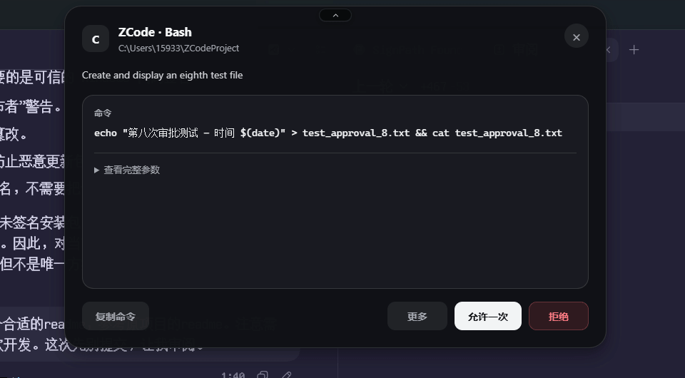
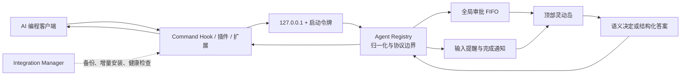

# Vibe Halo

<div align="center">

[English](README.md) · **简体中文**

**面向 Windows、macOS 与常见 Linux 的 Codex、ZCode、Claude Code、OpenCode 权限审批弹窗与灵动岛通知工具。**

集中处理客户端明确支持的权限请求与交互问题，并在任务完成时提醒你，减少来回切换 Agent 终端。


[](LICENSE)

[下载发行版](https://github.com/DaliBerr/Vibe-Halo/releases) ·
[报告问题](https://github.com/DaliBerr/Vibe-Halo/issues) ·
[发布说明](docs/RELEASING.md)

<br><br>



</div>

> [!NOTE]
> **实机验证范围：**Codex 与 ZCode 已在维护者的 Windows 环境完成真实客户端往返测试。macOS/Linux 当前只有 CI、协议、打包和启动冒烟验证；其他客户端/平台组合仍可能存在兼容性 Bug，评估时请保留客户端原生审批入口。

> [!IMPORTANT]
> Vibe Halo 是 [Clawd on Desk](https://github.com/rullerzhou-afk/clawd-on-desk) 的二次开发与独立维护分支，不是上游官方版本。项目保留并改造了上游的 Hook、插件、审批传输、进程探测和生命周期设计，移除了桌宠、主题、会话状态动画、远程审批与移动端能力，将产品重心收敛为一个三平台顶部灵动岛。上游版权与贡献归属见 [NOTICE.md](NOTICE.md)。

Vibe Halo 在需要你注意时出现在当前工作显示器顶部：审批请求可以直接允许或拒绝，支持稳定回答协议的问题可以在岛内作答，任务结束时显示短暂通知。没有明确决定、应用不可用或协议异常时，请求会安全交回原客户端，不会自动允许或拒绝。

## 快速开始

1. 从 [GitHub Releases](https://github.com/DaliBerr/Vibe-Halo/releases) 下载对应平台产物：Windows x64 NSIS、macOS 12+ arm64/x64 DMG 或 ZIP、Linux x64 AppImage/deb。
2. 启动 Vibe Halo，从托盘打开“客户端集成”，检查本机客户端检测结果与集成健康状态。
3. 如果使用 Codex，请先在 Codex 输入 `/hooks`，审核已安装的 Vibe Halo command Hook，再触发一次审批。

Windows 安装器和应用内置英文、简体中文资源。应用默认跟随操作系统 UI 语言，也可以从托盘“语言”中即时切换，无需重启。

> [!WARNING]
> 标记为 **Preview（预览版）** 的安装包仅供测试。Windows SmartScreen 可能显示“未知发布者”；macOS 包仅使用 ad-hoc 临时签名，未使用 Developer ID 签名且未经公证，需要在 Finder 中右键应用并选择“打开”。所有预览包都关闭自动更新。

源码运行、集成细节和完整验证流程见[安装与配置](#安装与配置)。

## 目录

- [快速开始](#快速开始)
- [为什么使用 Vibe Halo](#为什么使用-vibe-halo)
- [主要特性](#主要特性)
- [客户端支持](#客户端支持)
- [工作方式](#工作方式)
- [安装与配置](#安装与配置)
- [日常使用](#日常使用)
- [安全与隐私](#安全与隐私)
- [架构](#架构)
- [开发](#开发)
- [测试](#测试)
- [构建与发布](#构建与发布)
- [环境变量](#环境变量)
- [常见问题](#常见问题)
- [故障排查](#故障排查)
- [已知边界](#已知边界)
- [参与贡献](#参与贡献)
- [上游、致谢与许可证](#上游致谢与许可证)

## 为什么使用 Vibe Halo

AI 编程客户端经常在后台等待权限、询问补充信息或悄悄完成任务。Vibe Halo 把这些需要人工介入的节点汇总到一个轻量窗口中，同时保留各客户端原生流程作为最终兜底。

- **只在需要时出现**：没有待处理事件时窗口完全隐藏，不占任务栏。
- **顶部居中**：紧凑态位于当前工作显示器顶部，适配多屏和 DPI。
- **一个队列**：所有客户端共享全局 FIFO，避免多个审批窗口互相覆盖。
- **明确来源**：标题始终显示请求来自哪个客户端。
- **安全回退**：关闭、断线、超时、非法响应或未知选项均不产生决定。
- **本地优先**：Agent 事件通过带进程令牌的 loopback 服务传递，不提供远程审批入口。

## 主要特性

### 灵动岛交互

- 紧凑态显示客户端、事件摘要和待处理数量，点击后展开完整内容。
- 展开态展示命令、补丁、查询、说明、工作目录及经过边界限制的结构化参数。
- 顶部中央按钮或 `Esc` 可收回紧凑态，不会关闭通知或对审批作出决定。
- 操作区固定在底部；选项超过三个时，低频操作进入“更多”菜单。
- 交互表单支持单选、多选和自由文本；最多 10 个问题、每题最多 20 个选项。
- 原生浅色/深色外观、平滑尺寸动画、多显示器定位和高 DPI 约束。

### 审批与通知

- 允许一次、拒绝、交回客户端等选项只按客户端真实协议映射，不推导不存在的长期规则。
- OpenCode 只有在原请求明确支持时才显示 `Always`。
- 同一客户端的重复请求会去重，并把最终结果返回所有等待连接。
- 完成通知默认显示 8 秒；新的提示或审批会优先展示并清理旧通知。
- UI 优先级固定为：**审批/精确交互 > 等待输入 > 完成通知**。

### 集成管理

- 启动时按可执行文件或已初始化配置检测客户端，并对检测到的客户端增量安装或修复集成。
- 首次修改每个客户端配置前独立备份；JSON、JSONC、TOML 和插件安装均保留第三方内容。
- 尊重客户端的显式禁用设置，例如 Codex `hooks=false`；Vibe Halo 不会静默改回。
- 托盘可逐项停用或重新启用客户端，也可重新扫描、修复全部或卸载全部集成。
- 用户停用的客户端会记录 override，后续启动不会自动重装。

### 更新

- 只有发布者签名匹配的 Windows 正式构建才启用自动更新。macOS/Linux 在具备签名和公证发布链前保持关闭。
- 正式构建从 GitHub Releases 后台检查并下载稳定版本。
- 下载完成后必须从托盘明确选择“重启并更新”；普通退出不会自动安装。
- 更新前先关闭本地服务，把待处理审批和问题交回客户端原生流程。
- 本地构建和未签名安装包有意禁用自动更新。

## 客户端支持

Vibe Halo 当前注册 19 个客户端。这里的“支持”表示仓库包含对应适配器和契约测试，不代表所有客户端都已经通过真实运行验收。

> [!WARNING]
> 当前只有 **Codex** 与 **ZCode** 在维护者环境完成了真实客户端触发、灵动岛交互和结果回传验证。其余 17 个客户端主要依据公开协议、旧仓库实现和自动契约测试完成适配，尚未进行完整实机验证，可能存在客户端版本差异、配置格式变化或响应协议 Bug。使用这些集成前请保留客户端原生审批入口，并通过托盘诊断确认状态。

| 能力层级 | 客户端 | Vibe Halo 行为 |
| --- | --- | --- |
| 灵动岛审批 | Codex、ZCode、Qwen Code、Copilot CLI、Claude Code、CodeBuddy、Hermes、OpenCode | 显示客户端明确提供的审批选项，并编码为原生协议响应 |
| 岛内精确回答 | ZCode `AskUserQuestion`、Claude/CodeBuddy Elicitation、Hermes clarify | 显示结构化表单，并把答案映射回客户端原协议 |
| 原生审批提醒 | Kimi Code、Qoder、QoderWork | 提醒你回到客户端完成审批，不代替客户端作答 |
| 完成/状态通知 | Gemini CLI、Antigravity、Cursor Agent、Kiro、CodeWhale、Pi、OpenClaw、Reasonix，以及上述客户端 | 在 `Stop` 或等价事件后显示完成通知；新提示清除同会话旧通知 |

> [!NOTE]
> Codex `request_user_input` 目前只有只读提醒。Vibe Halo 会监控 Codex session JSONL 来判断请求是否结束，但不会向 session 文件写入答案，也不会绕过 Codex 原生回答界面。

## 工作方式



1. 客户端 Hook 或托管插件把事件转换为有界请求。
2. Hook 从 `~/.vibe-halo/runtime.json` 读取当前进程的 loopback 端口和启动令牌。
3. 主进程根据 `agentId` 选择适配器，归一化审批、交互问题或状态事件。
4. 当前请求进入全局队列；Renderer 只收到展示需要的数据和稳定的 option ID。
5. 用户选择后，主进程再次验证当前 ID、选项和答案，再由适配器编码为客户端协议。
6. 任何一步无法安全完成时，返回该客户端认可的“无决定”结果，让原生流程接管。

## 安装与配置

### 使用发行版

前往 [GitHub Releases](https://github.com/DaliBerr/Vibe-Halo/releases) 下载：

| 平台 | 支持基线 | 产物 |
| --- | --- | --- |
| Windows | Windows 10/11 x64 | `Vibe-Halo-Setup-<version>-x64.exe` |
| macOS | macOS 12+，Apple Silicon 或 Intel | `Vibe-Halo-<version>-arm64.dmg` / `.zip`、`Vibe-Halo-<version>-x64.dmg` / `.zip` |
| Linux | Ubuntu 22.04/24.04 或 Debian 12 x64 | `Vibe-Halo-<version>-x64.AppImage`、`Vibe-Halo-<version>-x64.deb` |

其他 Linux 发行版可尝试 AppImage，但不属于首版保证范围。预览包有意不签名，请只从本仓库下载并核对发布页的 SHA-256。

安装并启动后：

1. Vibe Halo 常驻系统托盘；没有事件时不会显示主窗口。
2. 应用扫描本机已安装或已有配置的受支持客户端，并增量写入自己的 Hook/插件记录。
3. 打开托盘“客户端集成”检查检测和健康状态。
4. 如果使用 Codex，请在 Codex 输入 `/hooks`，审核用户级 `~/.codex/hooks.json` 中 Vibe Halo 的 `PermissionRequest`、`Stop` 和 `UserPromptSubmit` 条目。
5. 在客户端触发一次审批或完成事件，确认灵动岛能够出现并正确回传。

Windows 安装器会根据系统显示语言自动选择英文或简体中文，不额外弹出语言选择框。应用启动后可独立切换语言，不会修改系统设置。

> [!WARNING]
> Codex 0.129.0 及后续版本要求用户亲自信任新增或变化的 command Hook。Vibe Halo 可以写入和修复配置，但不会绕过这个信任步骤。

#### macOS 首次启动

预览版仅带有保证 Apple Silicon 可靠启动所需的 ad-hoc 临时签名，未使用 Apple Developer ID 签名，也未公证。从 DMG 将应用拖入“应用程序”后，请在 Finder 中按住 Control 点击或右键 Vibe Halo，选择“打开”并确认一次。Vibe Halo 以 accessory 应用运行，不显示 Dock 图标，也不申请辅助功能或屏幕录制权限。

#### Linux 窗口后端

Vibe Halo 优先使用 X11。Wayland 会话只要存在 `DISPLAY` 就使用 XWayland，以保留窗口定位和展开动画；缺少 XWayland 时进入原生 Wayland 降级模式，诊断会明确提示定位、缩放和焦点能力受限。仅在确实需要强制原生模式时设置 `VIBE_HALO_NATIVE_WAYLAND=1`。

### 从源码运行

从源码运行适合贡献、调试集成或验证未发布功能。它同样会检测并增量修改真实客户端配置，因此请先阅读上面的集成行为。

#### 前置条件

- Windows x64、macOS 12+ arm64/x64 或 Linux x64；真实客户端人工验收仍以 Windows 为主。
- [Node.js 24](https://nodejs.org/) 与 npm（与发布 CI 一致）。
- Git。
- 至少一个受支持客户端，用于真实集成测试；只运行自动测试时不需要。

```powershell
git clone https://github.com/DaliBerr/Vibe-Halo.git
Set-Location Vibe-Halo

# 严格按 lockfile 安装依赖
npm ci

# 先运行自动测试
npm test

# 启动 Electron 应用
npm start
```

需要修改依赖时使用 `npm install` 并同步提交 `package-lock.json`；其他情况下优先使用 `npm ci` 保持可复现。

## 日常使用

### 灵动岛

- **展开**：点击紧凑态。
- **收起**：点击展开态顶部中央的小型灵动岛按钮，或按 `Esc`。
- **关闭审批**：点击 `×` 不等于拒绝；Vibe Halo 返回无决定，让客户端原生流程继续。
- **允许/拒绝**：只有当前请求的有效按钮会产生响应。
- **复制内容**：展开后可复制主要内容，复制载荷有长度限制。
- **查看完整参数**：使用折叠详情查看已净化的结构化输入。

### 托盘菜单

| 菜单项 | 作用 |
| --- | --- |
| `启用审批` | 全局控制岛内审批；关闭后审批交回客户端，完成通知仍可工作 |
| `等待输入提醒` | 控制只读输入提醒和原生审批提醒 |
| `开机启动` | 控制操作系统登录后启动 Vibe Halo |
| `客户端集成` | 查看状态、逐项停用/启用、重新扫描、修复或卸载全部 |
| `审核 Codex Hook…` | 提示在 Codex `/hooks` 中完成官方信任审核 |
| `修复 Codex Hook` | 增量修复 Vibe Halo 管理的 Codex 配置 |
| `诊断信息` | 查看服务、队列、集成验证、更新状态和日志路径 |
| `语言` | 选择“跟随系统”、English 或“简体中文”；当前窗口和排队项目会立即刷新 |
| `检查更新` | 仅在受信任签名的正式构建中出现 |

### 移除集成

可以从“客户端集成 → 卸载全部…”移除所有 Vibe Halo 管理项，或在源码目录执行：

```shell
npm start -- --uninstall-hooks
```

Windows NSIS 卸载程序也会调用相同清理流程。macOS 将应用拖入废纸篓无法执行集成清理，因此删除应用前必须先运行“卸载全部…”。Linux 删除 AppImage 或软件包前也建议先执行同一操作。遗留启动器会安全回退，但显式清理可以避免客户端留下失效 Hook。清理只删除 Vibe Halo 自己的 Hook/插件记录；第三方配置、首次备份以及应用用户数据会保留。

## 安全与隐私

- 服务只监听 `127.0.0.1`，不绑定局域网或公网地址。
- 每次启动生成新令牌；服务要求令牌，并限制单个请求最大为 256 KiB。
- OpenCode reverse bridge 使用独立随机 bearer token、请求 ID、重放保护和 loopback 目标校验。
- Renderer 启用 context isolation、sandbox，禁用 Node、导航和新窗口。
- Renderer 不能访问客户端原始协议载荷、配置规则、bridge token 或更新器。
- IPC 校验当前请求 ID、option ID、类型、答案数量和长度。
- 日志不会记录启动令牌或完整命令内容；日志按大小轮换。
- 应用不提供遥测、账号系统、云端同步或远程审批服务。
- 签名正式版只会为更新检查访问公开 GitHub Releases；未签名和源码构建不会启用更新器。
- 客户端配置使用原子写入、首次备份和拥有者标记；显式禁用设置不会被自动覆盖。

运行时身份默认位于：

```text
%USERPROFILE%\.vibe-halo\runtime.json
```

应用设置、日志和集成备份位于 Electron `userData` 目录，典型 Windows 安装路径为：

```text
%APPDATA%\Vibe Halo\
├── settings.json
├── logs\main.log
└── integration-backups\
```

## 架构

### 技术栈

| 层级 | 技术 |
| --- | --- |
| 桌面运行时 | Electron 41、CommonJS、Node.js |
| UI | 原生 HTML、CSS、JavaScript；单透明 `BrowserWindow` |
| 本地通信 | Node HTTP、仅 loopback、每进程令牌 |
| 平台集成 | `PlatformAdapter`、Windows `koffi`、POSIX 启动器、系统托盘 |
| 打包 | x64 NSIS、arm64/x64 DMG 与 ZIP、x64 AppImage 与 deb |
| 自动更新 | 仅 Windows 签名稳定通道；macOS/Linux 预览版关闭 |
| 测试 | Node 内置 test runner |
| 发布 | GitHub Actions、electron-builder、SignPath Foundation |

项目不使用数据库、Web 后端、前端框架、Docker 或 `.env` 文件。

### 目录结构

```text
.
├── src/
│   ├── main.js                  # Electron 生命周期、托盘与服务装配
│   ├── platform-adapter.js      # 平台路径、稳定 Hook、开机启动、通知与窗口后端
│   ├── agent-registry.js        # 19 个适配器、归一化、选项和决策编码
│   ├── integration-manager.js   # 检测、备份、安装、健康、修复与卸载
│   ├── server.js                # 带令牌的 127.0.0.1 HTTP 网关
│   ├── approval-store.js        # 全局审批 FIFO、去重与连接生命周期
│   ├── input-request-store.js   # 等待输入/原生审批提醒队列
│   ├── completion-store.js      # 完成通知生命周期
│   ├── codex-input-monitor.js   # 只读监控 Codex session JSONL
│   ├── island-controller.js     # 单窗口、定位、优先级、IPC 与动画
│   ├── update-manager.js        # 签名构建门控、检查、下载与显式安装
│   ├── shutdown-coordinator.js  # 普通退出与更新共用的安全关闭顺序
│   └── renderer/                # 原生灵动岛 UI
├── hooks/
│   ├── vibe-halo-hook.js        # 自包含通用 command Hook
│   └── integrations/            # Hermes、OpenCode、OpenClaw、Pi 托管资产
├── test/                         # 协议、队列、安装器、IPC、窗口和发布测试
├── scripts/                      # 签名暂存、更新元数据与发布配置工具
├── docs/
│   ├── assets/vibe-halo-demo.gif # README 动态演示
│   └── RELEASING.md              # SignPath 与签名发布手册
├── electron-builder.config.cjs   # Windows、macOS 与 Linux 打包配置
├── README.md                     # 英文主文档
├── README.zh-CN.md               # 简体中文文档
├── LICENSE                       # AGPL-3.0-only
└── NOTICE.md                     # 上游版权与二次开发说明
```

## 开发

### 可用命令

| 命令 | 说明 |
| --- | --- |
| `npm ci` | 按 lockfile 安装完全一致的依赖 |
| `npm install` | 安装并允许更新 lockfile；仅在依赖变更时使用 |
| `npm test` | 运行全部 Node 自动测试 |
| `npm start` | 从源码启动 Electron 应用并扫描本机集成 |
| `npm run build:dir` | 生成当前宿主平台的未安装目录 |
| `npm run build` | 生成当前宿主平台的未签名安装包 |
| `npm run build:win` | 生成 Windows x64 NSIS 包 |
| `npm run build:mac:arm64` / `npm run build:mac:x64` | 在 macOS 生成 DMG 与 ZIP |
| `npm run build:linux:x64` | 在 Linux 生成 x64 AppImage 与 deb |
| `npm run build:prepackaged` | 从预打包目录生成 NSIS；主要供签名工作流使用 |
| `npm run release:metadata` | 为已签名安装包重新生成 blockmap、哈希和 `latest.yml` |

### 隔离冒烟运行

普通 `npm start` 会扫描真实客户端配置。需要验证启动而不接触真实配置时，可以在一个新的 PowerShell 会话中临时重定向相关目录：

```powershell
$testRoot = Join-Path $PWD ".smoke"
$env:USERPROFILE = Join-Path $testRoot "home"
$env:APPDATA = Join-Path $testRoot "appdata"
$env:LOCALAPPDATA = Join-Path $testRoot "localappdata"
$env:CODEX_HOME = Join-Path $testRoot "codex"
$env:VIBE_HALO_USER_DATA = Join-Path $testRoot "userdata"
$env:VIBE_HALO_RUNTIME_DIR = Join-Path $testRoot "runtime"
$env:VIBE_HALO_TEST = "1"

npm start -- --smoke-test
```

`.smoke/` 已被 Git 忽略。关闭该 PowerShell 会话即可丢弃这些临时环境变量。

### 开发原则

- 保持 CommonJS、原生 Renderer 和单窗口架构。
- 协议、队列、超时、IPC、窗口尺寸或配置安装行为变化必须补回归测试。
- 不提交 `node_modules/`、`dist/`、`.smoke/`、日志、密钥或本机运行时数据。
- 修改 Hook 命令路径后，运行“修复全部”，并在 Codex `/hooks` 中重新审核命令。
- 关闭、错误和协议不确定性必须继续执行无决定回退。

## 测试

```powershell
npm test
```

自动测试覆盖：

- 19 个适配器的注册、能力、事件归一化和有界输出。
- 各审批协议的允许、拒绝、无决定和结构化答案快照。
- 跨客户端 FIFO、去重隔离、重复连接、超时、断线和 shutdown 回退。
- loopback 认证、请求上限、非法 option ID、bridge token 和重放保护。
- JSON、JSONC、TOML、插件安装的备份、幂等、第三方配置保留和安全卸载。
- 设置迁移、自动检测、用户停用 override、诊断和更新状态。
- Renderer IPC、动态按钮、问题表单、窗口尺寸、阴影边界、多屏定位与 X11 来源窗口匹配。
- Windows/POSIX Hook mock-server 端到端、稳定启动器路径与离线回退。
- SignPath 外部签名暂存、元数据生成和发布配置。

Windows 的透明窗口、阴影、焦点、动画、多屏/DPI、真实客户端 Hook 回传、托盘、NSIS 卸载和签名更新仍需人工验收。macOS/Linux 当前仅完成 CI 协议、打包、启动器与启动冒烟；真实客户端回传尚未实机验证。

## 构建与发布

### 本地构建

```shell
npm run build:dir
npm run build
```

各平台输出：

```text
Windows: Vibe-Halo-Setup-<version>-x64.exe
macOS:   Vibe-Halo-<version>-arm64|x64.dmg 与 .zip
Linux:   Vibe-Halo-<version>-x64.AppImage 与 .deb
```

本地产物预期为未签名，并且 `autoUpdateEnabled=false`。不要把本地产物冒充正式更新发布。

### 三平台预览版

`preview-<version>` 标签会触发跨平台工作流：在 Windows 2025、macOS 15 arm64/Intel、Ubuntu 24.04 上测试；在 Windows 2025、两种 macOS 架构与 Ubuntu 22.04 上构建；最终把所有安装包和 `SHA256SUMS.txt` 发布为 GitHub Pre-release。该流程不会发布稳定更新元数据。

### Windows 签名正式版

正式版本由 `v<version>` 标签触发 GitHub Actions。工作流会：

1. 验证标签版本和提交属于 `main`。
2. 安装依赖并运行完整测试。
3. 构建应用，依次签名主程序、NSIS elevation helper、卸载程序和安装程序。
4. 校验每个 Authenticode 签名的完整发布者 Subject。
5. 从最终签名字节重新生成 blockmap、SHA-256 和 `latest.yml`。
6. 静默安装、验证已安装文件、卸载，再发布 GitHub Release。

完整的 SignPath Foundation 配置、仓库变量、secret 和发布步骤见 [docs/RELEASING.md](docs/RELEASING.md)。

## 环境变量

正常安装不需要手工配置环境变量。以下变量用于自定义客户端目录、测试或发布：

| 变量 | 用途 |
| --- | --- |
| `CODEX_HOME` | 覆盖 Codex 配置和 session 根目录 |
| `COPILOT_HOME` | 覆盖 Copilot CLI 配置目录 |
| `OPENCLAW_STATE_DIR` | 覆盖 OpenClaw 状态目录 |
| `VIBE_HALO_RUNTIME_DIR` | 覆盖 loopback runtime identity 目录 |
| `VIBE_HALO_USER_DATA` | 覆盖 Electron `userData`；用于测试隔离 |
| `VIBE_HALO_TEST=1` | 启用自动测试/冒烟模式，避免真实开机启动和更新 |
| `VIBE_HALO_NATIVE_WAYLAND=1` | 强制使用原生 Wayland；窗口定位和动画可能降级 |
| `VIBE_HALO_SCREENSHOT` | 在 demo 测试中保存窗口截图 |
| `VIBE_HALO_PUBLISHER_NAME` | 正式构建期指定完整 Authenticode 发布者 Subject，并启用更新门控 |
| `VIBE_HALO_EXTERNAL_SIGNING=1` | 启用 electron-builder 外部 SignPath 暂存脚本 |
| `VIBE_HALO_SIGN_STAGE_DIR` | 外部签名工作流的暂存目录 |
| `VIBE_HALO_SIGNED_ELEVATE` | 指向已签名的 NSIS elevation helper |
| `VIBE_HALO_SIGNED_UNINSTALLER` | 指向已签名的 NSIS 卸载程序 |
| `VIBE_HALO_RELEASE_DATE` | 为更新元数据提供可复现发布时间 |

签名变量只应由受保护的 CI 环境设置。SignPath API token 是 GitHub Actions secret，不属于应用环境变量，绝不能写入源码、日志或发布资产。

## 常见问题

### Vibe Halo 是 Vibe Island 的跨平台替代方案吗？

Vibe Halo 在 Windows、macOS 与常见 x64 Linux 上提供类似的顶部审批与通知工作流，但它是独立维护的开源项目，并非 Vibe Island 的官方版本。只有在 AI 编程客户端需要支持的权限决定、提出支持的交互问题或完成任务时，它才会出现。

### 不切回终端也能批准 Codex 权限吗？

可以。受支持的 Codex `PermissionRequest` 事件可直接在权限审批弹窗中允许或拒绝。如果 Vibe Halo 无法安全返回决定，或者你关闭审批、等待超时，它会返回“无决定”，让 Codex 恢复原生审批流程。Codex `request_user_input` 目前仍然只能提醒，必须回到 Codex 作答。

### Vibe Halo 支持 Claude Code 和 OpenCode 吗？

仓库包含 Claude Code 与 OpenCode 的适配器、安装器和自动契约测试，但维护者环境目前只有 Codex 与 ZCode 完成了完整的真实客户端往返验证。请把 Claude Code、OpenCode 及其他未实测客户端视为预览支持，并保留它们的原生审批界面。

## 故障排查

### 灵动岛没有出现

1. 确认托盘中显示“服务已运行”或客户端集成健康状态。
2. 确认“启用审批”或“等待输入提醒”处于开启状态。
3. 打开“客户端集成”，对目标客户端执行“重新扫描”或“修复全部”。
4. 查看“诊断信息”，确认客户端是“健康”“需修复”还是“未检测”。
5. 使用“诊断信息 → 打开日志目录”查看 `main.log`。

### Codex 显示 Hook 待审核

1. 在 Codex 输入 `/hooks`。
2. 找到用户级 `~/.codex/hooks.json`。
3. 审核并信任 Vibe Halo 的 `PermissionRequest`、`Stop` 和 `UserPromptSubmit`。
4. 回到托盘执行“修复 Codex Hook”，再次检查诊断。

### 客户端已检测但无法安装

- 如果诊断显示“客户端禁用 Hook”，请先在客户端配置中明确启用；Vibe Halo 不会替你覆盖禁用值。
- 如果客户端只有可执行文件、尚未初始化配置目录，请先运行该客户端一次。
- 用户主动停用的集成不会自动恢复，需要在“客户端集成”子菜单重新勾选。
- 客户端更新可能改变未稳定的 Hook 协议；请附上客户端版本和净化后的诊断信息提交 Issue。

### 点击关闭后客户端仍在等待

这是预期行为。关闭审批不会替你选择“拒绝”；Vibe Halo 返回无决定，客户端应恢复其原生审批流程。若原生界面没有恢复，请记录客户端版本和事件类型后报告问题。

### 托盘中没有更新选项

源码运行、本地打包和未签名构建会有意禁用自动更新。只有发布者签名通过验证的官方 Windows 构建才显示更新控制；macOS/Linux 预览包始终关闭。

## 已知边界

- 发布目标为 Windows x64、macOS 12+ arm64/x64，以及 Ubuntu 22.04/24.04 或 Debian 12 x64。其他 Linux 仅通过 AppImage 尽力支持；不提供 Linux arm64、RPM、Snap、Flatpak 或 Mac App Store 包。
- 原生 Wayland 无法保证同等的自由定位、缩放和聚焦能力；默认优先 XWayland，原生模式会在诊断中明确标记降级。
- 应用和 Windows 安装器支持英文与简体中文；不支持的系统 locale 默认回退英文，也可手动选择简体中文。
- 不包含上游 Clawd on Desk 的桌宠、动画主题、会话 Dashboard、终端聚焦、远程 SSH、PWA 或移动端功能。
- 不支持远程审批，服务不会监听局域网地址。
- 不是所有客户端都公开稳定的审批或回答协议；不支持的能力只提醒或交回原客户端。
- Codex `request_user_input` 不能在岛内回答。
- 状态型客户端只显示完成或注意事件，不展示持续工作动画。
- 当前只有 Windows 上的 Codex 与 ZCode 完成真实客户端端到端验证；macOS/Linux 和其他集成即使 CI 与契约测试通过，也可能存在尚未发现的兼容性 Bug。

## 参与贡献

欢迎提交 Bug、协议兼容性报告和聚焦于灵动岛体验的改进建议。

1. 先在 [Issues](https://github.com/DaliBerr/Vibe-Halo/issues) 描述目标、客户端版本和可复现步骤。
2. 从最新 `main` 创建单一职责分支。
3. 保持第三方配置增量合并和无决定回退语义。
4. 为行为变化补测试并运行 `npm test`。
5. 涉及窗口、Hook 或打包时，在说明中记录对应宿主平台的人工或 CI 验收结果。

请不要提交真实客户端配置、运行时令牌、完整命令日志或其他个人数据。

## 上游、致谢与许可证

Vibe Halo 派生自 [rullerzhou-afk/clawd-on-desk](https://github.com/rullerzhou-afk/clawd-on-desk)。感谢上游维护者和贡献者建立的多客户端 Hook、插件、审批传输与生命周期基础。

与上游相比，本仓库进行的是产品方向明确的二次开发：

- 从跨平台桌宠收敛为聚焦三平台的顶部灵动岛。
- 删除桌宠美术、主题系统、动画状态机、远程与移动端功能。
- 保留并重构适合本地审批、结构化问答和完成通知的协议部分。
- 强化全局 FIFO、Renderer 隔离、配置所有权、安全回退和签名更新链。

本项目由 Vibe Halo 贡献者独立维护，与 Clawd on Desk 上游维护者、OpenAI、Anthropic 或其他客户端厂商没有官方隶属或背书关系。

源代码按 [GNU Affero General Public License v3.0 only](LICENSE)（`AGPL-3.0-only`）发布。再分发或部署修改版本时，请遵守 AGPL-3.0 的源代码提供义务，并保留 [NOTICE.md](NOTICE.md) 中的上游版权与归属说明。
