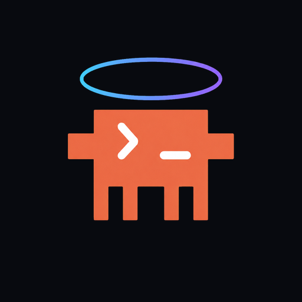
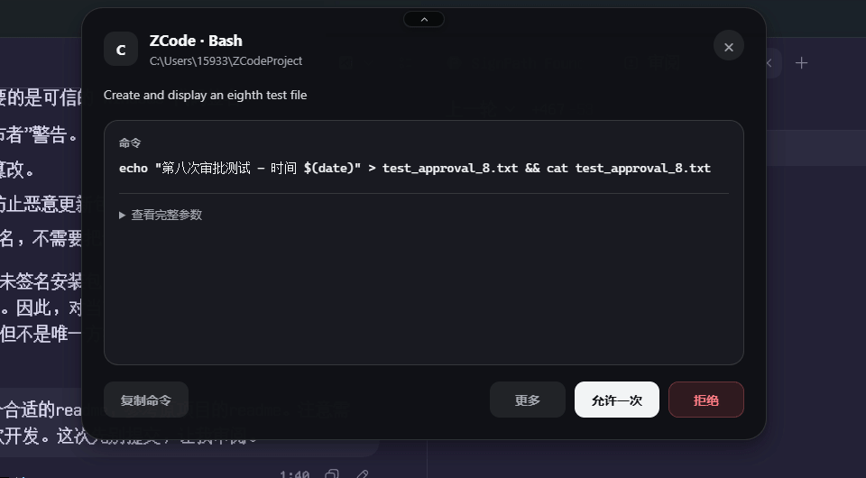

# Vibe Halo

<p align="center"></p>

[English](README.md) · **简体中文**

为 AI 编程客户端提供桌面灵动岛：处理支持的审批和问答，接收待处理提醒与任务完成通知。可选 Android 伴侣支持配对通知、审批和历史记录。


[](LICENSE)



## 下载

| 平台 | 安装包 | 状态 |
| --- | --- | --- |
| Windows x64 | [NSIS 安装程序](https://github.com/DaliBerr/Vibe-Halo/releases/latest) | 稳定版；确认重启后安装更新 |
| macOS 12+ | [Apple Silicon / Intel DMG、ZIP](https://github.com/DaliBerr/Vibe-Halo/releases/tag/preview-0.6.0) | 预览版；仅临时签名，未经公证 |
| Linux x64 | [AppImage、deb](https://github.com/DaliBerr/Vibe-Halo/releases/tag/preview-0.6.0) | 预览版 |
| Android 8+ | [原签名伴侣 APK](https://github.com/DaliBerr/Vibe-Halo/releases/download/v0.6.0/Vibe-Halo-Mobile-0.6.0.apk) | 预览版；小米后台设置仍需真机验证 |

Windows 可能提示未知发布者。桌面预览版不启用自动更新。Codex、ZCode 已在 Windows 上完成真实客户端验证；macOS/Linux 目前有 CI 打包和启动检查，其他集成仍可能存在客户端兼容问题。

## 主要功能

- 所有桌面审批进入同一队列；没有有效决定时返回客户端原有流程。
- 客户端支持精确答案协议时可在岛内回答；Codex 问题提醒回到 Codex 作答。
- 任务完成通知，以及从托盘打开的可选历史窗口。
- Android 配对通知、明确授权后的远程控制、易读历史卡片和设备改名。
- 中英文界面，跟随系统深浅色。

共注册 19 种客户端集成，能力各有不同，详见[客户端支持表](docs/GUIDE.zh-CN.md#客户端支持)。

## 开始使用

1. 安装并启动 Vibe Halo，从托盘打开“客户端集成”，检查所用客户端的配置。
2. 使用 Codex 时，按提示通过 `/hooks` 审核 Vibe Halo 的命令 Hook。
3. 连接手机时，在电脑打开“手机伴侣”，再按手机引导配对。核对两端指纹后完成绑定；需要远程控制时，在电脑上明确授权。
4. 手机允许通知后，按引导调整后台设置。不同厂商的具体操作需要在设备上确认。

桌面默认连接公共伴侣中继，可在伴侣设置中关闭远程访问；手机必须配对才能连接。原 Hook 服务仅监听本机回环地址，伴侣通信加密。历史可能包含任务内容，详见[安全与隐私说明](docs/GUIDE.zh-CN.md#安全与隐私)。

## 本地开发

使用 Node.js 24 和 npm：

```sh
npm ci
npm test
npm start
```

Android 开发还需要 JDK 21 和 Android SDK 36。构建步骤与配置见下方文档。

## 文档

- [使用与开发指南](docs/GUIDE.zh-CN.md)：集成、排障、架构和本地打包。
- [Android 伴侣配置](docs/REMOTE_SETUP.md)：配对、Firebase、自托管与 Android 构建。
- [发布指南](docs/RELEASING.md)：安装包、签名和更新。
- [反馈问题](https://github.com/DaliBerr/Vibe-Halo/issues)：附系统、客户端版本及复现步骤，不要上传密钥或私人任务内容。

## 许可证与致谢

基于 [Clawd on Desk](https://github.com/rullerzhou-afk/clawd-on-desk) 二次开发，独立维护，专注灵动岛界面；Android 伴侣为独立实现。与上游维护者和受支持客户端厂商无隶属关系。

采用 [AGPL-3.0-only](LICENSE) 许可证。分发和部署修改版时，请遵守源码提供义务并保留上游归属，详见 [NOTICE.md](NOTICE.md)。
